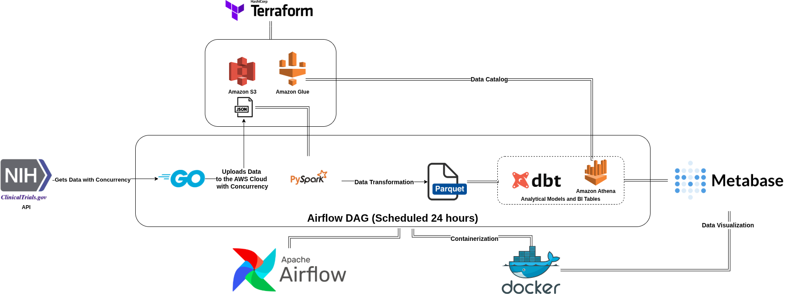

## License
MIT License © 2026 Daniel Lacerda Oliveira

# Cancer Clinical Trials Pipeline

**End-to-End Data Engineering Pipeline for Clinical Trials Analytics**

Cancer Clinical Trials Pipeline is a cloud-native data engineering project that automates the ingestion, processing, transformation, and visualization of clinical trial data.

The project combines modern data engineering tools including Apache Airflow, PySpark, dbt, AWS S3, AWS Glue, Athena, Terraform, Docker, and Metabase to create a complete analytics platform for clinical research data.

---

## Motivation

Clinical trial datasets are large, complex, and continuously updated.

Researchers and analysts often need to:

* Collect clinical trial information from external sources
* Store raw data reliably
* Transform semi-structured JSON data into analytical datasets
* Build reusable data models
* Query data efficiently
* Create dashboards and reports for decision-making

This project demonstrates how a modern data platform can automate the entire process.

---

## Architecture Overview

The pipeline follows the architecture:


## Pipeline Workflow

The Airflow DAG orchestrates the following steps:

### 1. Data Extraction

Clinical trials data from ClinicalTrials.gov API are collected and stored as raw JSON files using Golang.

Output:

```text
data/raw/
```

### 2. Upload to S3

Raw files are uploaded to Amazon S3 using Golang.

Output:

```text
s3://bucket/raw/
```

### 3. PySpark Processing

PySpark cleans and transforms raw JSON data into structured datasets.

Output:

```text
Silver Layer
```

### 4. dbt Transformations

dbt creates analytical models and business-ready tables.

Examples:

* Trials by disease
* Trials by phase
* Trials by enrollment
* Trials by status
* Trials by study type
* Trials with published results

Output:

```text
Gold Layer
```

### 5. Analytics

Data is queried through Athena.

### 6. Visualization

Metabase dashboards provide interactive exploration of clinical trial data.

---

## Prerequisites

Install:

* Docker
* AWS Account with Glue, S3 and Athena Permissions
* Terraform

---

## Environment Variables

Create a `.env` file:

```bash
AWS_REGION=YOUR_REGION
AWS_DEFAULT_REGION=YOUR_REGION
AWS_ACCESS_KEY_ID=YOUR_ACCESS_KEY
AWS_SECRET_ACCESS_KEY=YOUR_SECRET_KEY
S3_BUCKET_NAME=YOUR_BUCKET_NAME
```

---

## Infrastructure Deployment

Provision AWS resources:

```bash
make infra
```

Terraform creates:

* S3 Bucket
* Glue Catalog resources

---

## Build Containers

```bash
make build
```

---

## Initialize Airflow

```bash
make init
```

This command:

* Starts PostgreSQL
* Initializes Airflow metadata database

---

## Start Services

```bash
make up
```

Services started:

* Airflow Scheduler
* Airflow Webserver
* Metabase

---

## Run the Pipeline

Open:

```text
http://localhost:8080
```

Enable and execute:

```text
cancer-clinical-trials-pipeline
```

Airflow will orchestrate the complete workflow automatically.

---

## Metabase

```text
http://localhost:3000
```

Explore:

* Clinical trials by disease
* Clinical trials by phase
* Enrollment statistics
* Study status distributions
* Results availability

---

## Destroy Infrastructure

Remove containers:

```bash
docker compose down -v
```

Destroy cloud infrastructure:

```bash
make destroy
```

---

## CI

GitHub Actions automatically validates:

* Go builds
* Docker images
* Terraform formatting
* Terraform validation

---

## Future Improvements

* Airflow deployment on Kubernetes
* CI/CD deployment to AWS

---

## License

MIT License © 2026 Daniel Lacerda Oliveira

[](https://linkedin.com/in/daniel-oliveira-30785b1ba)